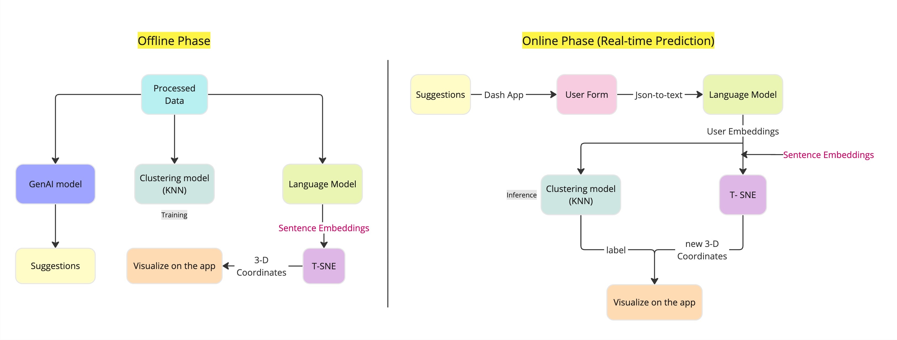

# Job Sphere: Your Personal Job Recommendations Application

- This project implements a job role recommendation system that matches user input to predefined job role clusters using advanced NLP techniques and plots the user on the job sphere interactive graph. The system is designed to help users identify relevant job roles based on their skills and qualifications.
- The project consists of two phases described in the following figure:

    


- The data used in this prject is initially taken from [Kaggle](https://www.kaggle.com/datasets/niyamatalmass/google-job-skills). The data has been cleaned and preprocessdd. You can access data preprocessing and visualisation codes  (EDA) from `notebooks/google-job-skills-preprocessing_visualizations.ipynb`

## Installation

- To be able to run the application we first need to install all the required packages by running:
```
git clone https://github.com/k-uu/cluster_jobs.git
cd cluster_jobs
pip3 install -U pip
pip3 install -r requirements.txt
````


## Running the application
on the root folder of the application you can run:
```
python3 app.py
````
Then you may go to the localhost:5050 or http://127.0.0.1:5050/ to acccess the application. 